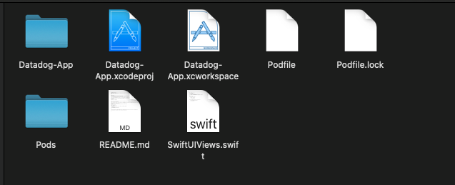

# Datadog Solutions App
Swift iOS App created for testing the debugging issues related to the iOS SDK for both logs and traces. (RUM will be added soon after release) <br />
&nbsp;


## Installation
1) Need to download Xcode from the Mac Store in order to run this application:
https://apps.apple.com/us/app/xcode/id497799835?mt=12
This software contains the simulators and tools that are needed to run the app. 

2) Once you have downloaded the software, it's time to install the [command line](https://guides.cocoapods.org/using/getting-started.html) used to include dependencies/packages in your Xcode project by running the following command in your terminal:

```bash
sudo gem install cocoapods
```

3) Once you have downloaded the Xcode software and the command line tool cocoapods, you can clone the project from github down to your local machine. 

4) Once the project has been cloned, create a file called Podfile in the root of your directory and inside of the file copy and paste the following and save:
```file
# Uncomment the next line to define a global platform for your project
platform :ios, '13.0'

target 'Datadog-App' do
  # Comment the next line if you don't want to use dynamic frameworks
  use_frameworks!

  # Pods for Datadog-App
  pod 'DatadogSDK', '~> 1.3.0-beta1'

end
```
5) In the pod file we are adding the SDK we want to use and which version in which in this case is 1.3.0-beta1. Once you have saved the file, go back to your terminal and run pod install.

For reference you directory should now look liek the following:


6) The final step would be to click on the Datadog-App.xcworkspace file and this should open up xcode <br />
&nbsp;

How to use xcode video coming soon. 