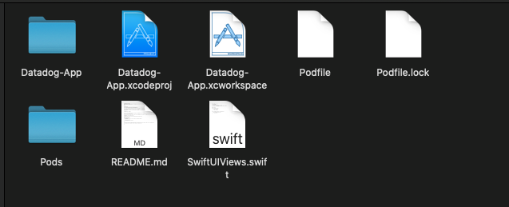
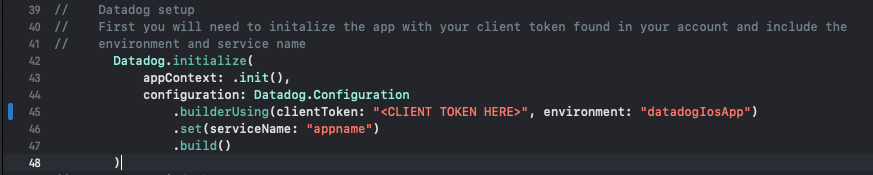
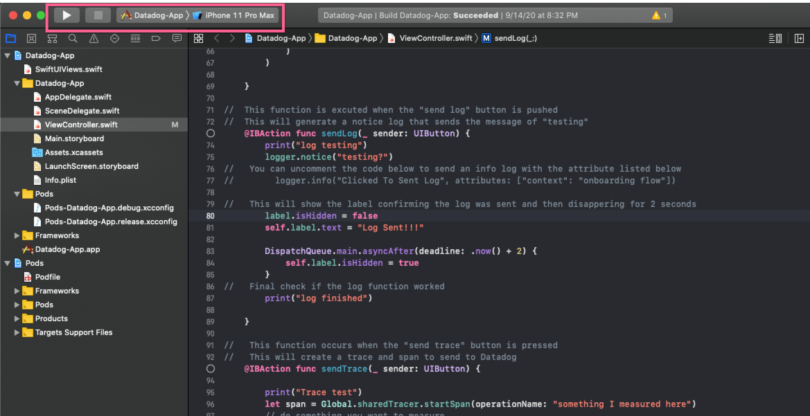
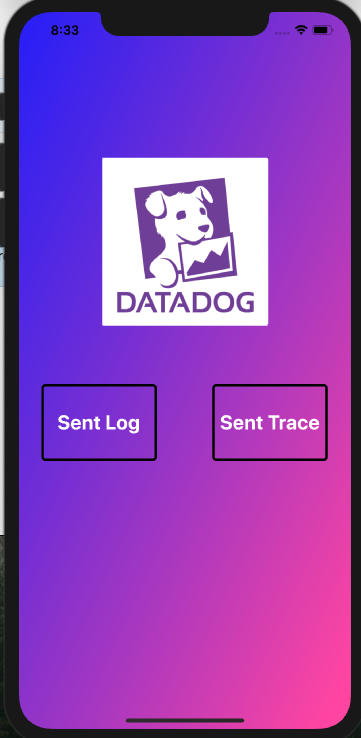
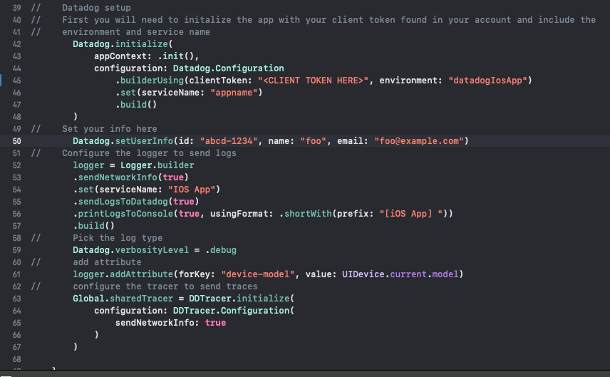
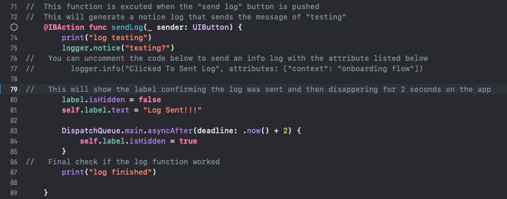
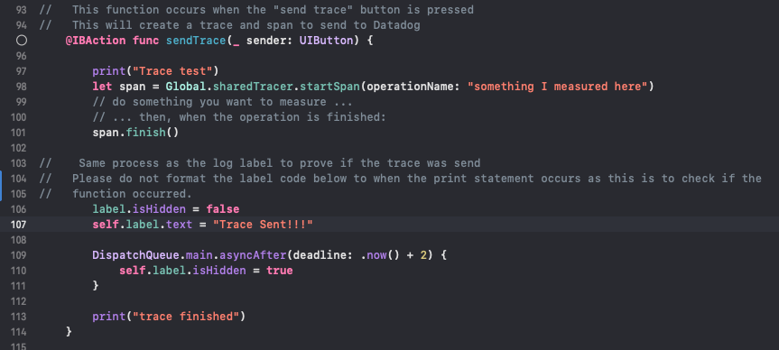

# Datadog Solutions App
This read me is for a Swift iOS App created for testing/debugging issues related to iOS SDK for both logs and traces. (RUM will be added soon after release) <br />
&nbsp;

## Installation
1) First download Xcode from the Mac Store in order to run this application:
https://apps.apple.com/us/app/xcode/id497799835?mt=12
This software contains the simulators and tools that are needed to run the app. 

2) Once you have downloaded the software, it's time to install the [command line](https://guides.cocoapods.org/using/getting-started.html) used to include dependencies/packages in your Xcode project by running the following command in your terminal:

```bash
sudo gem install cocoapods
```

3) Once you have downloaded the Xcode software and the command line tool cocoapods, you can clone the project from Github to your local machine. 

4) The desirec SDK version, 1.3.0-beta1, is added to the pod file. Once you have saved the file, run the following in your terminal:
```podfile
pod install
```

For reference your directory should now look like the following:


6) Finally, click on the Datadog-App.xcworkspace file to open xcode <br />
&nbsp;

## App Usage
(Video will be added for a visual walkthrough)

The ViewController.swift file is the main file that contains all necessary configurations and functions. The is the file referenced in the remainder of this document referencing moving forward. 

The app already has both the logging and tracing portions setup so you do not have to configure them, but you will need to include your client token in the Datadog setup section as per the image below: (Note: the client token can be created and found in the API page of your Datadog account)

Image link: https://a.cl.ly/GGuRGXez
 <br />
&nbsp;

To test the app on the simulator, simply press the play button on the top right of the screen:
 
Image link: https://a.cl.ly/Jru6rzAK
<br />
&nbsp;

After clicking on the play icon, it should open up the simulator and the app itself as seen below:

<br />
&nbsp;

You can click on either "send log" or "send trace" and you should have either a log or trace in your account in a couple seconds. 

## Code Customization

Env and user setup: <br />
You are able to change the environment name, user info, etc in the Datadog setup section of the code:


https://a.cl.ly/qGuNewmB 
<br />
&nbsp;


Log customization: <br />
More options are available here in the doc's: https://docs.datadoghq.com/logs/log_collection/ios/?tab=cocoapods

Any changes occur in the code function "sendLog" below:
<br />
&nbsp;

Trace customization: <br />
More options are available here in the doc's: https://docs.datadoghq.com/tracing/setup/ios/?tab=us

Any changes occur in the code function "sendTrace" below:


## Extra Youtube and Udemy courses if you're interested in iOS development:
Youtube: https://www.youtube.com/watch?v=_YvAUgV6GYM

Udemy course: https://datadog.udemy.com/course/the-10-day-iphone-app-bootcamp-new-ios-12-and-xcode-10/learn/lecture/10753420#overview

